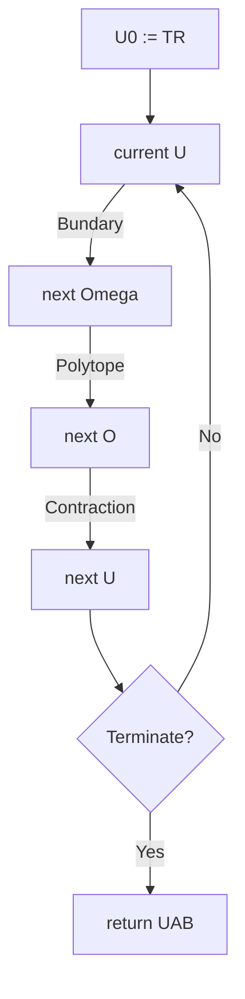

# XSE2016CAV

Under-approximating backward reachable sets by polytopes

## Pipeline

## Options

target region: $\mathrm{TR}$

time duration: $T$

time step: $h$ such that $\frac{T-0}{h} \geq 1$ is an integer

size of intervals enclosing the boundaries: $\epsilon_{M}$

local error bounds: $\epsilon$

## References

[1]: Xue, B., She, Z., & Easwaran, A. (2016, July). Under-approximating backward reachable
sets by polytopes. In International Conference on Computer Aided Verification
(pp. 457-476). Springer, Cham.