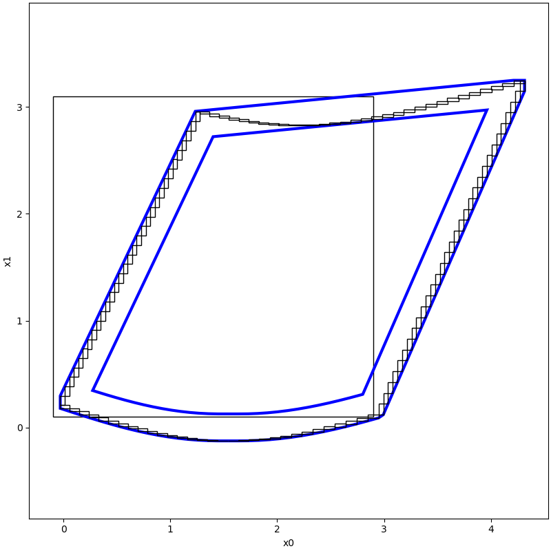

# Under Approximation of Reachable set

We test our implementation on a PC with following configurations:

| Hardware |                        Detail                        | 
|:--------:|:----------------------------------------------------:|
|   CPU    |  Intel(R) Core(TM) i7-11800H CPU @ 2.30GHz (8 CPUs)  |
|  Memory  |                         16GB                         |
|   GPU    |                       RTX3060                        |

## Settings

Based on the synchronous machine model of dimension 2, the XSE2016CAV algorithm is called to compute the
under-approximation of the reachable set: the under-approximation of the reachable set from the initial set [-0.1,2.9]
× [0.1,3.1] is computed at moment 0.5.

```python
from __future__ import annotations

import numpy as np

np.seterr(divide='ignore', invalid='ignore')

from pyrat.geometry import Geometry, Zonotope, Interval
from pyrat.geometry.operation import cvt2, boundary
from pyrat.algorithm import ASB2008CDC, XSE2016CAV
from pyrat.dynamic_system import NonLinSys
from pyrat.model import Model, synchronous_machine
from pyrat.util.visualization import plot

# init system
system = NonLinSys(Model(synchronous_machine, [2, 1]))

epsilon = 0.1
opt = ASB2008CDC.Options()
opt.t_end = 1
opt.step = 0.05
opt.r0 = Interval([-0.1, 0.1], [2.9, 3.1])
opt.tensor_order = 2
opt.taylor_terms = 4
opt.u = Zonotope.zero(1, 1)
opt.u_trans = np.zeros(1)

# reach
assert opt.validation(system.dim)
tp_set = [opt.r0]
opt.r0 = boundary(opt.r0, epsilon, Geometry.TYPE.ZONOTOPE)

_, tp, _, _ = ASB2008CDC.reach(system, opt)

vis_idx = [int(len(tp) / 2) - 1]

for this_idx in vis_idx:
    omega = [cvt2(zono, Geometry.TYPE.INTERVAL) for zono in tp[this_idx]]
    o = XSE2016CAV.polytope(omega)
    p, _ = XSE2016CAV.contraction(omega, o)
    tp_set.append(p)
    tp_set.append(o)
    tp_set += omega

plot(tp_set, [0, 1])
```



| Error | Time (second) | 
|:-----:|:-------------:|
|   0   |     11.55     |