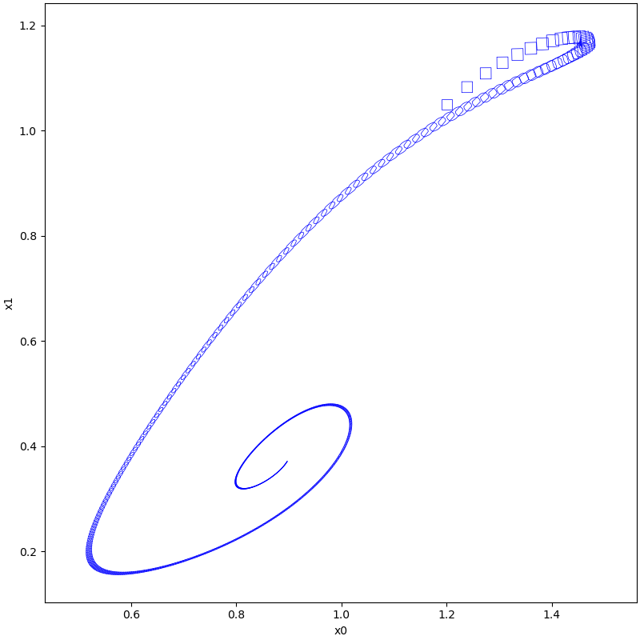
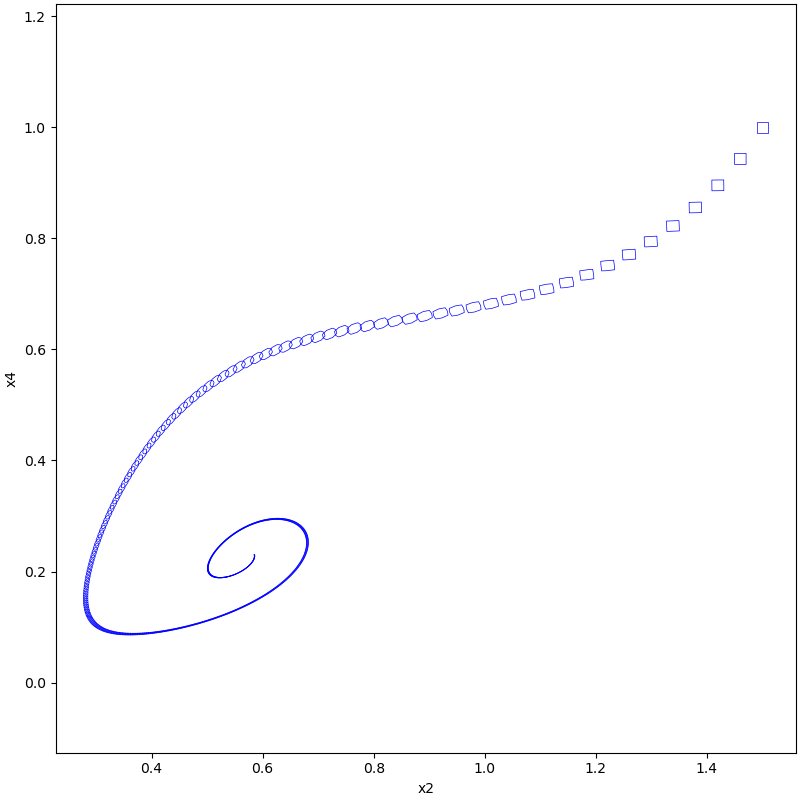
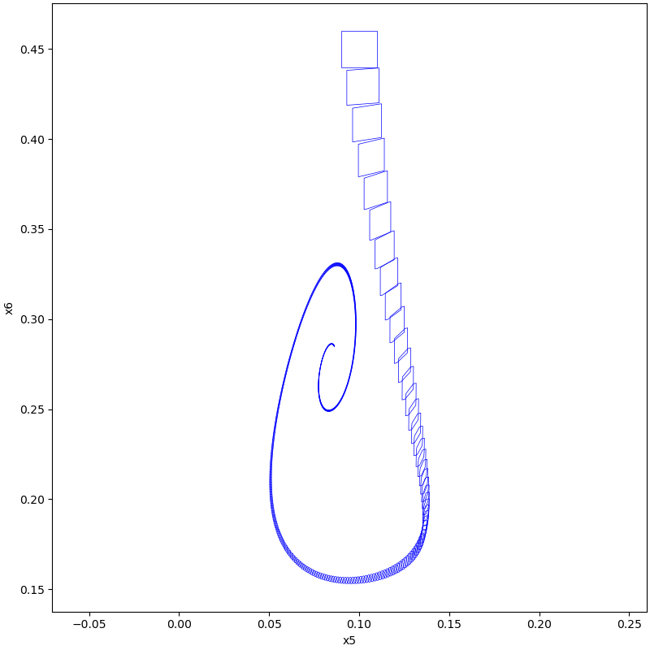
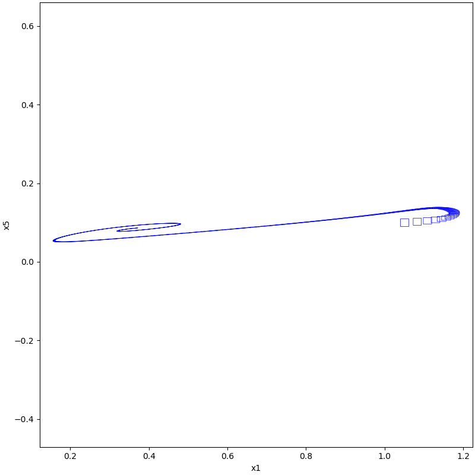
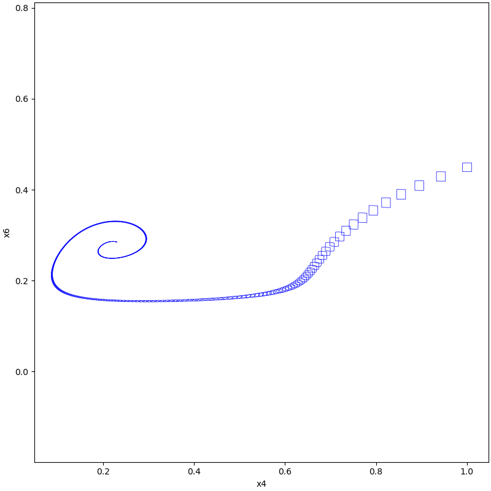

# Laub Loomis

## System

$$
\begin{align*}
\dot{x}_{0} &= 1.4 x_{2} - 0.9 x_{0} \\
\dot{x}_{1} &= 2.5 x_{4} - 1.5 x_{1} \\
\dot{x}_{2} &= 0.6x_{6} - 0.8 x_{1} x_{2} \\
\dot{x}_{3} &= 2 - 1.3 x_{2} x_{3} \\
\dot{x}_{4} &= 0.7 x_{0} - x_{3}x_{4} \\
\dot{x}_{5} &= 0.3 x_{1} - 3.1 x_{5} \\
\dot{x}_{6} &= 1.8 x_{5} - 1.5 x_{1} x_{6}
\end{align*}
$$

## Implementation

```python
# init dynamic system
system = NonLinSys.Entity(LaubLoomis())

# settings for the computation
options = ASB2008CDC.Options()
options.t_end = 20
options.step = 0.04
options.tensor_order = 2
options.taylor_terms = 4
options.r0 = [Zonotope([1.2, 1.05, 1.5, 2.4, 1, 0.1, 0.45], np.eye(7) * 0.01)]
options.u = Zonotope([0], [[0.005]])
options.u = Zonotope.zero(1, 1)
options.u_trans = np.zeros(1)

# settings for using geometry
Zonotope.REDUCE_METHOD = Zonotope.METHOD.REDUCE.GIRARD
Zonotope.ORDER = 50

tps = ASB2008CDC.reach(system, options)

plot(tps, [0, 1])
plot(tps, [2, 4])
plot(tps, [5, 6])
plot(tps, [1, 5])
plot(tps, [4, 6])
```

## Results





