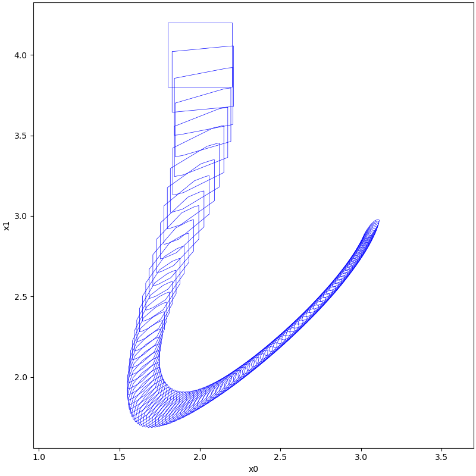
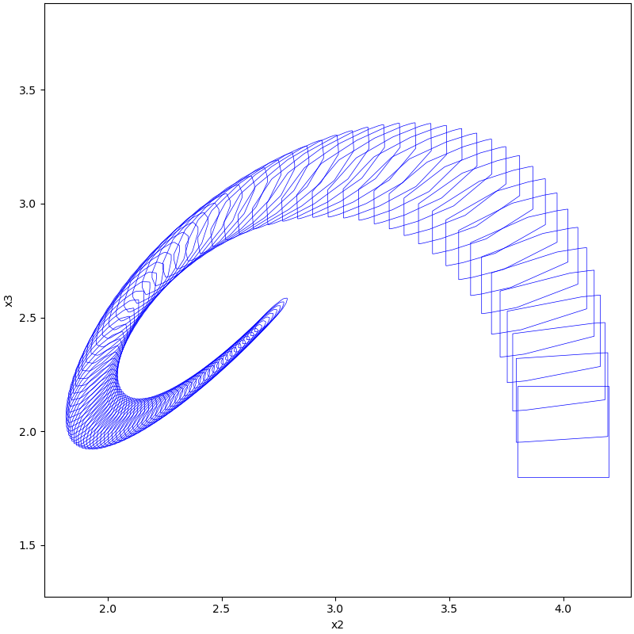
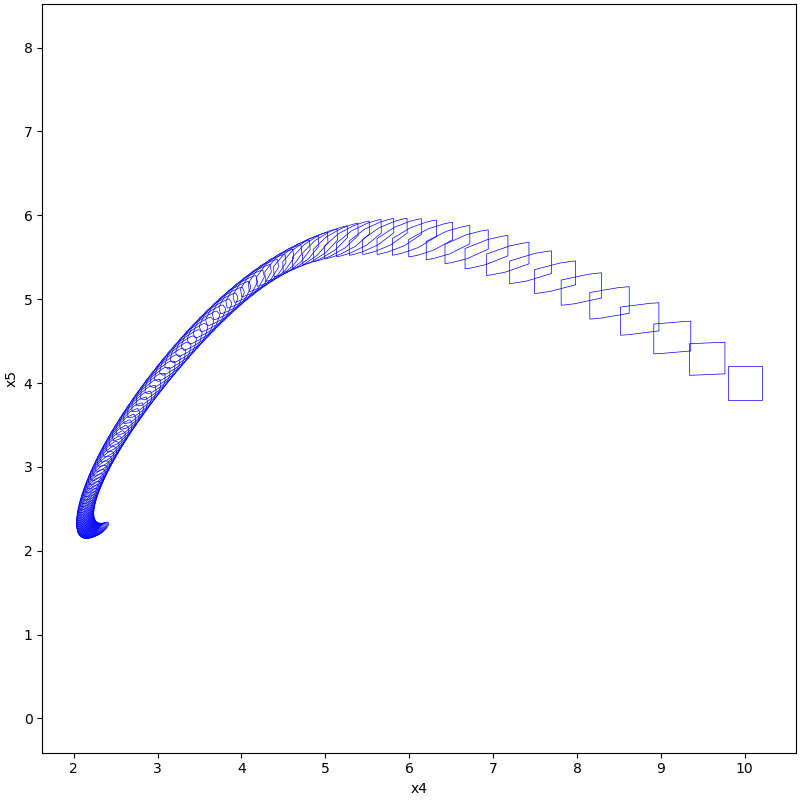

# Water Tank 6Eq

## System

$$
\begin{align*}
\dot{x}_{0} &= u_{0} + 0.1 + k_{1} (4 -x_{5}) - k_{0} \sqrt{2gx_{0}} \\
\dot{x}_{1} &= k_{0} \sqrt{2g (x_{0}-x_{1})} \\
\dot{x}_{2} &= k_{0} \sqrt{2g (x_{1}-x_{2})} \\
\dot{x}_{3} &= k_{0} \sqrt{2g (x_{2}-x_{3})} \\
\dot{x}_{4} &= k_{0} \sqrt{2g (x_{3}-x_{4})} \\
\dot{x}_{5} &= k_{0} \sqrt{2g (x_{4}-x_{5})}
\end{align*}
$$

where $k_{0} = 0.015, k_{1}= 0.01, g=9.81$

## Implementation

```python
from pyrat.system import NonLinSys

# init dynamic system
system = NonLinSys.Entity(Tank6Eq())

# settings for the computation
options = ASB2008CDC.Options()
options.t_end = 400
options.step = 4
options.tensor_order = 2
options.taylor_terms = 4
options.r0 = [Zonotope([2, 4, 4, 2, 10, 4], np.eye(6) * 0.2)]
options.u = Zonotope([0], [[0.005]])
options.u = Zonotope.zero(1, 1)
options.u_trans = np.zeros(1)

# settings for the using geometry
Zonotope.REDUCE_METHOD = Zonotope.METHOD.REDUCE.GIRARD
Zonotope.ORDER = 50

# reachable sets computation
tps = ASB2008CDC.reach(system, options)

# visualize the results
plot(tps, [0, 1])
plot(tps, [2, 3])
plot(tps, [4, 5])
```

## Results



