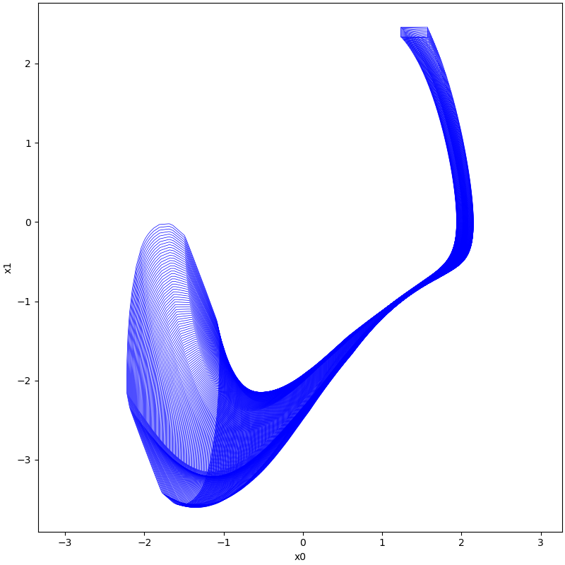

# Van der Pol oscillator

## System

$$
\begin{align*}
\dot{x} &=y \\
\dot{y} &=\mu (1-x^2)y-x \\
\mu &=1
\end{align*}
$$

## Implementation

```python
import numpy as np
from pyrat.algorithm import ASB2008CDC
from pyrat.dynamic_system import NonLinSys
from pyrat.geometry import Zonotope
from pyrat.model import *
from pyrat.util.visualization import plot

# init dynamic system
system = NonLinSys(Model(vanderpol, [2, 1]))

# settings for the computation
options = ASB2008CDC.Options()
options.t_end = 3.5
options.step = 0.01
options.tensor_order = 2
options.taylor_terms = 4
options.r0 = [Zonotope([1.4, 2.4], np.diag([0.17, 0.06]))]
options.u = Zonotope.zero(1, 1)
options.u_trans = np.zeros(1)

# settings for the using geometry
Zonotope.REDUCE_METHOD = Zonotope.REDUCE_METHOD.GIRARD
Zonotope.ORDER = 50

# reachable sets computation
ti, tp, _, _ = ASB2008CDC.reach(system, options)

tp = [[r.geometry for r in l] for l in tp]
# visualize the results
plot(tp, [0, 1])
```

## Results



