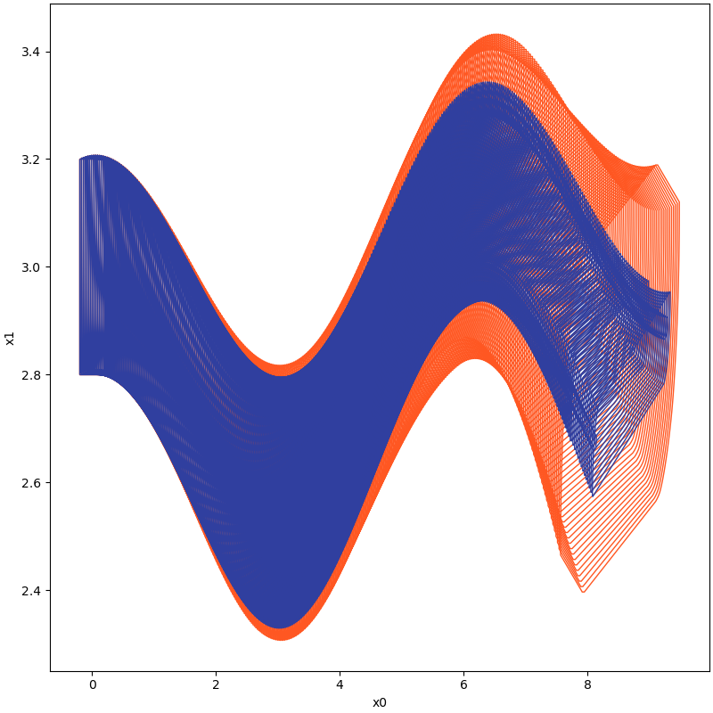

# Overview

## Motivation

Reachability analysis, which involves computing reachable state sets, plays a fundamental role in the temporal
verification of nonlinear systems. Overly pessimistic over-approximations, however, render many temporal properties
unverifiable in practice. This pessimism mainly arises due to the wrapping effect, which is the propagation and
accumulation of over-approximation error through the iterative computation in the construction of reachable sets. As the
extent of the wrapping effect correlates strongly with the volume of the initial set, techniques that partition the
initial state space and independently compute reachable sets of those partitions are often used to reduce the wrapping
effect, especially for large initial sets or/and large time horizons. Such partitioning may, however, induce extensive
demand on computation time and memory, often rendering the existing reachability analysis techniques not suitable for
complex real-world applications. Not being forced to explore the full, i.g. exponential in the dimensionality, number of
partitions could help such procedures tremendously. This is the theme of this tool, which explores means of computing
the full reachable state space based on state-exploratory analysis of just a small sub-volume of the initial state set,
namely a set enclosing its boundary. For theoretical analysis, please refer
to [Xue, Bai, Arvind Easwaran, Nam-Joon Cho, and Martin Fränzle. "Reach-avoid verification for nonlinear systems based on boundary analysis." IEEE Transactions on Automatic Control 62, no. 7 (2016): 3518-3523.](https://ieeexplore.ieee.org/abstract/document/7585104).

## Installation

Currently, this tool only supports manually install from source code, which means just copy source code into appropriate
path like using Matlab libraries. In order to facilitate the addition and management of python system paths, it is
recommended that users use Pycharm as an IDE for code development and testing.

### Virtual Environment

We recommend that users use [miniconda](https://docs.conda.io/en/latest/miniconda.html)
to initialise a virtual environment for the subsequent installation and running of third party libraries. The steps are
as follows.

In the user's current working directory, the user can initialise a virtual test environment called `pybdr_lab` using the
following command.

```shell
conda create -n pybdr_lab
```

After the virtual environment has been initialized, the user activates the virtual test environment named pybdr_lab that
has just been initialized with the following command.

```shell
conda activate pybdr_lab
```

### Dependencies

Now, the user can install the necessary third party libraries in this virtual environment using the following
series of commands.

```shell
conda install matplotlib
conda install -c conda-forge numpy
conda install -c conda-forge cvxpy
conda install scipy
conda install -c mosek mosek
pip install pypoman
conda install -c anaconda sympy
pip install open3d
```

For the reason we may use Mosek as a solver for optimisation, we highly recommend you to apply for an official personal
licence, the steps for which can be found at [this link](https://docs.mosek.com/10.0/licensing/index.html).

## How to use

### Computing Reachable Sets based on Boundary Analysis for Nonlinear Systems

Example files are provided to show how to use the tool to calculate reachable sets. Users can refer to the example files
provided and modify the dynamics and parameters required for the calculation to see the effect of using different
settings for calculating system reachable sets.

For example, consider the [Van der Pol oscillator](docs/misc/models.md#van-der-pol-oscillator) dynamic system:

$$
\begin{align*}
\dot{x} &= y \\
\dot{y} &= (1-x^2)y-x
\end{align*}
$$

:::caution
The model is already built into the `model` module of this tool and can be loaded directly from it. The model can be
defined manually in the following way.

```python
from sympy import *

def vanderpol(x, u):
    mu = 1

    dxdt = [None] * 2

    dxdt[0] = x[1]
    dxdt[1] = mu * (1 - x[0] ** 2) * x[1] - x[0] + u[0]

    return Matrix(dxdt)
```

:::

The corresponding sample code is as follows:

```python
import numpy as np

from pyrat.algorithm import ASB2008CDC
from pyrat.dynamic_system import NonLinSys
from pyrat.geometry import Zonotope, Interval, Geometry
from pyrat.geometry.operation import boundary
from pyrat.model import *
from pyrat.util.visualization import plot

# init dynamic system
system = NonLinSys(Model(vanderpol, [2, 1]))

# settings for the computation
options = ASB2008CDC.Options()
options.t_end = 6.74
options.step = 0.005
options.tensor_order = 3
options.taylor_terms = 4
options.u = Zonotope.zero(1, 1)
options.u_trans = np.zeros(1)

z = Zonotope([1.4, 2.4], np.diag([0.17, 0.06]))

# -----------------------------------------------------
# computing reachable sets with boundary analysis
options.r0 = boundary(z, 1, Geometry.TYPE.ZONOTOPE)
# -----------------------------------------------------
# computing reachable sets without boundary analysis
# options.r0 = [z]
# -----------------------------------------------------

# settings for the using geometry
Zonotope.REDUCE_METHOD = Zonotope.REDUCE_METHOD.GIRARD
Zonotope.ORDER = 50

# reachable sets computation
ti, tp, _, _ = ASB2008CDC.reach(system, options)

# visualize the results
plot(tp, [0, 1])
```

We use this setting to check the evolution of this system in the time interval [0,6.74] using a time step of
0.005, and finally, comparison between reachable sets with and without `Boundary Analysis` (BA) can be visualized as
following:

|  With Boundary Analysis (BA)  |    No Boundary Analysis (NBA)    |
|:-----------------------------:|:--------------------------------:|
|  |  |

And more comparison :smirk_cat:

|                         Dynamic System                         |                                                            Implementation                                                            | Reachable Sets (Orange-NBA,Blue-BA) |
|:--------------------------------------------------------------:|:------------------------------------------------------------------------------------------------------------------------------------:|:-----------------------------------:|
| [synchronous machine](docs/misc/models.md#synchronous-machine) | [benchmark_synchronous_machine_cmp.py](https://github.com/ASAG-ISCAS/PyBDR/blob/master/example/benchmark_synchronous_machine_cmp.py) |       |
|                                                                |                                                                                                                                      |                                     |

### Computing Reachable Sets Based on Boundary Analysis for Neural ODE

TODO

## Misc

This tool provides necessary support to assist in the implementation of potential algorithms.

### interval tensor

In order to improve the efficiency of the calculation, this tool inherits the syntax of the third-party library `numpy`
for the characteristics of intervals, and constructs the interval tensor to support interval arithmetic. This data
structure inherits the syntax features of `numpy` and supports the interval tensor calculation based on the broadcast
mechanism, which realises the parallel calculation of interval data.

### interval compatible symbolic operations

The symbolic calculation relies heavily on the third-party library `sympy`. Since the calculation of the reachable
set of a non-linear system based on set propagation requires a Taylor expansion approximation of the non-linear system
at a specified state point, this tool provides derivative operations of arbitrary order for the system based on `sympy`,
and in combination with the aforementioned interval tensor data structure, it supports both real-valued and interval
operations for the value of the high-dimensional derivative tensor obtained from the symbolic calculation, simplifying
the implementation of subsequent algorithms for the reachable set calculation.

### dynamic models

Common dynamic models used in academic research are provided internally for testing and can be viewed in the
module `model`.

### visualization

In order to facilitate the analysis and presentation of the results of the calculated reachable sets, we provide
basic visualisation API for the visualisation of the calculated results, which already be implemented in the
`visualisation` module.

## Frequently Asked Questions and Troubleshooting

### the computation is slow

- The tool supports two modes of computation for reachable sets, one is to compute the reachable set of evolved states
  based on the entire initial set in a set propagation manner, and the other is to compute the reachable set of evolved
  states based on the boundary of the initial state set.

  There are several reasons for slow computations: large computational time intervals, small step, high Taylor expansion
  orders, and a large number of state variables.

  In order to speed up the computations, experiments can be carried out using a smaller computational time horizon, a
  smaller order of expansion such as 2, and a larger time step, and then gradually increase the computational time
  horizon and the order of expansion according to the results of this setting, in order to obtain the desired set of
  reachable states at a suitable time consumption.

### controlling the wrapping effect

- One can further improve the accuracy of the reachable set calculation based on splitting boundaries of initial sets,
  or by reducing the step and increasing the order of the Taylor expansion.

## Acknowledgement

This tool has been developed with reference to models used in tools such as Flow*, CORA and other
reachable set calculation tools.