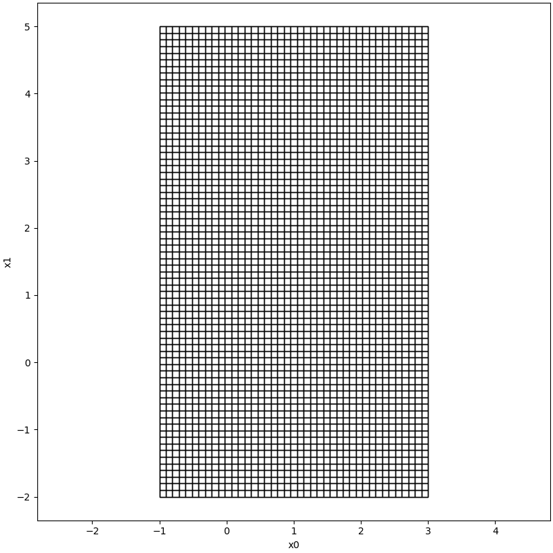

# Interval

## Definition

$$
{\cal I} \coloneqq \{ x \in \mathbb{R}^n | {\underline{x}}_{i} \leq x_{i} \leq \overline{x}_{i}, \forall i =1, \cdots ,
n \}
$$

:::caution
In order to do computation simultaneously for intervals, we use tensor as bounds but a real number in our
implementation, this is the difference between the theoretical definition and our real implementation, for more detail,
please check our source code.
:::

---

## Example

```python
from pyrat.geoemtry import Interval
from pyrat.util.visualization import plot
from pyrat.geometry import Geometry
from pyrat.geometry.operation import partition

a = Interval([-1,-2],[3,5])
parts = partition(a, 0.1, Geometry.TYPE.INTERVAL)
plot([*parts,a], [0, 1])
```



---

## Operations

### enclose

### boundary

___

## Arithmetic

### addition or '+'

$$
[x] + [y] = [\underline{x} + \underline{y}, \overline{x} + \overline{y}]
$$

### subtraction or '-'

$$
[x] - [y] = [\underline{x} - \overline{y}, \overline{x} - \underline{y}]
$$

### multiplication or '*'

$$
[x] \cdot [y] = [
\min{(\underline{x} \underline{y}, \underline{x} \overline{y}, \overline{x} \underline{y}, \overline{x} \overline{y})},
\max{(\underline{x} \underline{y}, \underline{x} \overline{y}, \overline{x} \underline{y}, \overline{x} \overline{y})}
]
$$

### division or '/'

$$
[x]/[y] = [x] \cdot (1/[y]), 1/[y]=
\begin{cases}
\emptyset & \text{if} \ y = [0,0] \\
[1/\overline{y}, 1/\underline{y}] & \text{if} \ 0 \notin [y] \\
[1/\overline{y}, \infty[ & \text{if} \ (\underline{y}=0) \land  (\overline{y}>0) \\
] - \infty, 1/\underline{y} & \text{if} \ (\underline{y}<0) \land (\overline{y}=0) \\
] - \infty, \infty[ & \text{if} \ (\underline{y}<0) \land (\overline{y}>0)
\end{cases}
$$

### power or '**'

$$
[x]^n = \begin{cases}  
[\underline{x}^n,\overline{x}^n] & \text{if} \ (\underline{x} < 0) \lor (n \ \text{uneven})\\
[\overline{x}^n, \underline{x}^n] & \text{if} \ (\overline{x} < 0) \land (n \ \text{even}) \\
[0,\max(|\underline{x}|,|\overline{x}|)^n] & \text{if} \ (0 \in [x]) \land (n \ \text{even})
\end{cases}
$$

where $n \in \N$

### absolute or '||'

$$
|[x]| =\begin{cases}
[|\overline{x}|,|\underline{x}|] & \text{if} \ \overline{x}<0 \\
[\underline{x}, \overline{x}] & \text{if} \ \underline{x}>0 \\
[0,\max(|\underline{x}|,|\overline{x}|)] & \text{if} \ 0 \in [x]
\end{cases}
$$

### matrix multiplication or '@'

+ real matrix with interval

$$
(X[Y])_{ij} = \sum_{k=1}^{n} X_{ik} [Y]_{kj}
$$

+ interval with real matrix

$$
([X]Y)_{ij} = \sum_{k=1}^{n} [X]_{ik} Y_{kj}
$$

+ with another interval matrix

$$
([X][Y])_{ij} = \sum_{k=1}^{n} [X]_{ik} [Y]_{kj}
$$

where $[X] \sube \R^{o \times n}$ and $[Y] \sube \R^{n \times p}$

### exponential

$$
e^{[x]} = [e^{\underline{x}}, e^{\overline{x}}]
$$

### log

$$
\log{([x])} = \begin{cases}
[\log{\underline{x}}, \log{\overline{x}} ] & \text{if} \ \underline{x}>0 \\
[\mathrm{NaN}, \log{\overline{x}}] & \text{if} \ (\underline{x} < 0) \land (\overline{x} \geq 0) \\
[\mathrm{NaN},\mathrm{NaN}] & \text{if} \ \overline{x} < 0
\end{cases}
$$

### sqrt

$$
\sqrt{[x]} =\begin{cases}
[\sqrt{\underline{x}},\sqrt{\overline{x}}] & \text{if} \ \underline{x} \geq 0 \\
[\mathrm{NaN}, \sqrt{\overline{x}}] & \text{if} \ (\underline{x} <0 ) \land (\overline{x} \geq 0) \\
[\mathrm{NaN}, \mathrm{NaN}] & \text{if} \ \overline{x}<0
\end{cases}
$$

### arcsin

$$
\arcsin([x])=\begin{cases}
[\arcsin(\underline{x}), \arcsin(\overline{x})] & \text{if} \ (\underline{x} \geq -1) \land (\overline{x} \leq 1), \\
[\arcsin(\underline{x}), \mathrm{NaN}] & \text{if} \ (\underline{x} \in [-1,1]) \land (\overline{x} > 1), \\
[\mathrm{NaN}, \arcsin(\overline{x})] & \text{if} \ (\underline{x} < -1) \land (\overline{x} \in [-1,1]), \\
[\mathrm{NaN}, \mathrm{NaN}] & \text{if} \ (\underline{x} < -1) \land (\overline{x} >1)
\end{cases}
$$

### arccos

$$
\arccos([x])=\begin{cases}
[\arccos(\overline{x}), \arccos(\underline{x})] & \text{if} \ (\underline{x} \geq -1) \land (\overline{x} \leq 1), \\
[\arccos(\overline{x}), \mathrm{NaN}] & \text{if} \ (\underline{x} < -1) \land (\overline{x} \in [-1,1]), \\
[\mathrm{NaN}, \arccos(\underline{x})] & \text{if} \ (\underline{x} \in [-1,1]) \land (\overline{x} > 1), \\
[\mathrm{NaN}, \mathrm{NaN}] & \text{if} (\underline{x} < -1) \land (\overline{x} >1)
\end{cases}
$$

### arctan

$$
\arctan([x])=[\arctan(\underline{x}), \arctan(\overline{x})]
$$

### sinh

$$
\sinh([x]) = [\sinh(\underline{x}), \sinh(\overline{x})]
$$

### cosh

$$
\cosh([x])=\begin{cases}
[\cosh(\overline{x}), \cosh(\underline{x})] & \text{if} \ \overline{x} <0 ,\\
[1, \cosh(\max(|\underline{x}|,|\overline{x}|))] & \text{if} \ (\underline{x} \leq 0) \land (\overline{x} \geq 0), \\
[\cosh(\underline{x}), \cosh(\overline{x})] & \text{if} \ \underline{x} >0
\end{cases}
$$

### tanh

$$
\tanh([x])=[\tanh(\underline{x}), \tanh(\overline{x})]
$$

### arcsinh

$$
\mathrm{arcsinh}([x])=[\mathrm{arcsinh}(\underline{x}), \mathrm{arcsinh}(\overline{x})]
$$

### arccosh

$$
\mathrm{arccosh}([x])= \begin{cases}
[\mathrm{arccosh}(\underline{x}), \mathrm{arccosh}(\overline{x})] & \text{if} \ \underline{x} \geq -1,\\
[\mathrm{NaN}, \mathrm{arccosh}(\overline{x})] & \text{if} \ (\underline{x}<1)\land(\overline{x} \geq 1 ), \\
[\mathrm{NaN}, \mathrm{NaN}] & \text{if} \ \overline{x} <1
\end{cases}
$$

### arctanh

$$
\mathrm{arctanh}(x)=\begin{cases}
[\mathrm{arctanh}(\underline{x}), \mathrm{arctanh}(\overline{x})] & \text{if} \ (\underline{x}>-1) \land (\overline{x}<
1), \\
[\mathrm{arctanh}(\underline{x}), \mathrm{NaN}] & \text{if} \ (\underline{x} \in ]-1,1[) \land (\overline{x} \geq 1), \\
[\mathrm{NaN}, \mathrm{arctanh}(\overline{x})] & \text{if} \ (\underline{x} \leq -1) \land (\overline{x} \in ]-1,1[), \\
[\mathrm{NaN}, \mathrm{NaN}] & \text{if} \ (\underline{x} \leq -1) \land (\overline{x} \geq 1)
\end{cases}
$$

### sin

$$
\sin([x])=\begin{cases}
[-1,1]  & \text{if} \ (\overline{x}-\underline{x} \geq 2\pi) \lor \\
&  (\underline{y} \in R_1 \land \overline{y} \in R_1 \land \underline{y} > \overline{y}) \lor \\
& (\underline{y} \in R_1 \land \overline{y} \in R_3) \lor \\
& (\underline{y} \in R_2 \land \overline{y} \in R_2 \land \underline{y} > \overline{y}) \lor \\
& (\underline{y} \in R_3 \land \overline{y} \in R_3 \land \underline{y} > \overline{y}) \\
[\sin(\underline{y}), \sin(\overline{y})] & \text{if} \ (\underline{y} \in R_1 \land \overline{y} \in R_1 \land
\underline{y} \leq \overline{y}) \lor \\
& (\underline{y} \in R_3 \land \overline{y} \in R_3) \lor \\
& (\underline{y} \in R_3 \land \overline{y} \in R_3 \land \underline{y} \leq \overline{y}) \\
[\min(\sin(\underline{y}),\sin(\overline{y})),1] & \text{if} \ (\underline{y} \in R_1 \land \overline{y} \in R_2), \\
& (\underline{y} \in R_3 \land \overline{y} \in R_2) \lor \\
[-1,\max(\sin(\underline{y}),\sin(\overline{y}))] & \text{if} \ (\underline{y} \in R_2 \land \overline{y} \in R_1) \lor
\\ & (\underline{y} \in R_2 \land \overline{y} \in R_3), \\
[\sin(\overline{y}),\sin(\underline{y})] & \text{if} \ (\underline{y} \in R_2 \land \overline{y} \in R_2 \land
\underline{y} \leq \overline{y})
\end{cases}
$$

where $R_1=[0,\frac{\pi}{2}[, R_2=[\frac{\pi}{2},\frac{3\pi}{2}[, R_3=[\frac{3\pi}{2}, 2\pi[,
\underline{y}=\mathrm{mod}(\underline{x},2\pi), \overline{y}=\mathrm{mod}(\overline{x},2\pi)$

### cos

$$
\cos([x])=\begin{cases}
[-1,1] & \text{if} \ (\overline{x} - \underline{x} \geq 2 \pi) \lor \\
& (\underline{y} \in R_1 \land \overline{y} \in R_1 \land \underline{y} > \overline{y}) \lor \\
& (\underline{y} \in R_2 \land \overline{y} \in R_2 \land \underline{y} > \overline{y}),\\
[\cos(\underline{y}), \cos(\overline{y})] & \text{if} \ (\underline{y} \in R_2 \land \overline{y} \in R_2 \land
\underline{y} \leq \overline{y}), \\
[\min(\cos(\underline{y}),\cos(\overline{y})),1] & \text{if} \ (\underline{y} \in R_2 \land \overline{y} \in R_1), \\
[-1,\max(\cos(\underline{y}),\cos(\overline{y}))] & \text{if} \ (\underline{y} \in R_1 \land \overline{y} \in R_2), \\
[\cos(\overline{y}), \cos(\underline{y})] & \text{if} \ (\underline{y} \in R_1 \land \overline{y} \in R_1 \land
\overline{y} \leq \overline{y})
\end{cases}
$$

where $R_1=[0,\pi[, R_2=[\pi,2\pi[, \underline{y}=\mathrm{mod}(\underline{x},2\pi), \overline{y}=\mathrm{mod}(
\overline{x},2\pi)$

###tan

$$
\tan([x])=\begin{cases}
]-\infty,\infty[ & \text{if} \ (\overline{x}-\underline{x} \geq \pi) \land \\
& (\underline{z} \in R_1 \land \overline{z} \in R_1 \land \underline{z} > \overline{z}) \lor \\
& (\underline{z} \in R_2 \land \overline{z} \in R_2 \land \underline{z} > \overline{z}) \lor \\
& (\underline{z} \in R_1 \land \overline{z} \in R_2), \\
[\tan(\underline{z}),\tan(\overline{z})] & \text{if} \ (\underline{z} \in R_1 \land \overline{z} \in R_1 \land
\underline{z} \in \overline{z}) \lor \\
& (\underline{z} \in R_2 \land \overline{z} \in R_2 \land \underline{z} \in \overline{z})
\end{cases}
$$

where $R_1=[0,\frac{\pi}{2}[, R_2=[\frac{\pi}{2}, \pi[, \underline{z}=\mathrm{mod}(\underline{x},\pi),
\overline{z}=\mathrm{mod}(\overline{x},\pi)$

### cot

$$
\cot([x]) = \begin{cases}
]-\infty,\infty[ & \text{if} \ (\overline{x}-\underline{x} \geq \pi) \lor (\underline{z} > \overline{z}), \\
[\cot(\overline{z}), \cot(\underline{z})] & \text{if} \ (\underline{z} \leq \overline{z})
\end{cases}
$$

where $\underline{z}=\mathrm{mod}(\underline{x},\pi),\overline{z}=\mathrm{mod}(\overline{x},\pi)$

## References

[1] Althoff, M., & Grebenyuk, D. (2016). Implementation of interval arithmetic in {CORA} 2016. In Proc. of the 3rd
International Workshop on Applied Verification for Continuous and Hybrid Systems (pp. 91-105).

[2]: Wikipedia contributors. (2022, May 5). Interval arithmetic. In Wikipedia, The Free Encyclopedia. Retrieved 08:05,
June 9, 2022, from https://en.wikipedia.org/w/index.php?title=Interval_arithmetic&oldid=1086274354

[3]: Rump, S. M. (1999). Fast and parallel interval arithmetic. BIT Numerical Mathematics, 39(3), 534-554.

[4]: Moore, R. E., Kearfott, R. B., & Cloud, M. J. (2009). Introduction to interval analysis. Society for Industrial and
Applied Mathematics.

[5]: Shary, S. P. (2019). Numerical computation of formal solutions to interval linear systems of equations. arXiv
preprint arXiv:1903.10272.

