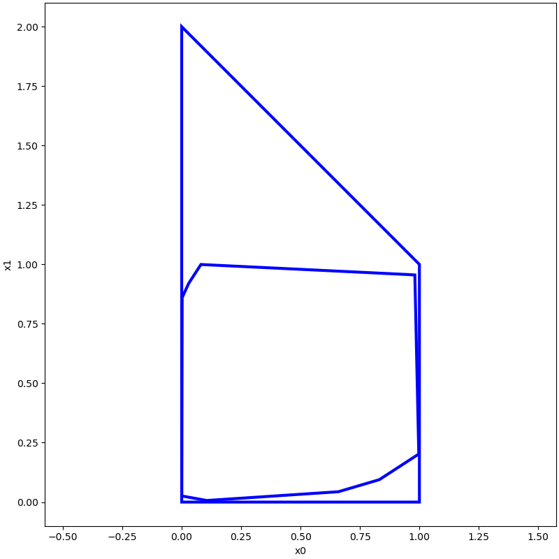

# Polytope

## Definition

### H-Representation

$$
{\cal P} \coloneqq \{ x \in \mathbb{R}^{n} | Cx \leq d\}, C \in \mathbb{R}^{q \times n}, d \in \mathbb{R}^{q}
$$

### V-Representation

$$
{\cal P} \coloneqq \{
\sum_{i=1}^{r} {\alpha}_{i} v^{i} | {\alpha}_{i} \in \mathbb{R}, {\alpha}_{i} \geq 0, \sum_{i=1}^{r} {\alpha}_{i}
=1
\}
$$

## Example

```python
import numpy as np

from pyrat.geometry import Polytope, Geometry
from pyrat.geometry.operation import cvt2
from pyrat.util.visualization import plot

# initial from linearly ineqalities Ax <= b
a = np.array(
    [
        [-1, 0, 0, 0, 0, 0, 0, 0, 0, 0, 0, 0],
        [0, -1, 0, 0, 0, 0, 0, 0, 0, 0, 0, 0],
        [0, 0, -1, 0, 0, 0, 0, 0, 0, 0, 0, 0],
        [0, 0, 0, -1, 0, 0, 0, 0, 0, 0, 0, 0],
        [0, 0, 0, 0, -1, 0, 0, 0, 0, 0, 0, 0],
        [0, 0, 0, 0, 0, -1, 0, 0, 0, 0, 0, 0],
        [0, 0, 0, 0, 0, 0, -1, 0, 0, 0, 0, 0],
        [0, 0, 0, 0, 0, 0, 0, -1, 0, 0, 0, 0],
        [0, 0, 0, 0, 0, 0, 0, 0, -1, 0, 0, 0],
        [0, 0, 0, 0, 0, 0, 0, 0, 0, -1, 0, 0],
        [0, 0, 0, 0, 0, 0, 0, 0, 0, 0, -1, 0],
        [0, 0, 0, 0, 0, 0, 0, 0, 0, 0, 0, -1],
        [1, 1, 1, 0, 0, 0, 0, 0, 0, 0, 0, 0],
        [0, 0, 0, 1, 1, 1, 0, 0, 0, 0, 0, 0],
        [0, 0, 0, 0, 0, 0, 1, 1, 1, 0, 0, 0],
        [0, 0, 0, 0, 0, 0, 0, 0, 0, 1, 1, 1],
        [1, 0, 0, 1, 0, 0, 1, 0, 0, 1, 0, 0],
        [0, 1, 0, 0, 1, 0, 0, 1, 0, 0, 1, 0],
        [0, 0, 1, 0, 0, 1, 0, 0, 1, 0, 0, 1],
    ]
)
b = np.array([0, 0, 0, 0, 0, 0, 0, 0, 0, 0, 0, 0, 2, 1, 2, 2, 1, 2, 3])
p_from_inequalities = Polytope(a, b)

points=np.random.rand(100,2)
p_from_vertices=cvt2(points,Geometry.TYPE.POLYTOPE)

plot([p_from_inequalities,p_from_vertices], [0, 1])
```



## Operations

### enclose

### boundary

## Arithmetic

### scalar operations

<details>
<summary> addition or '+'</summary>

</details>

<details>
<summary>subtraction or '-'</summary>
</details>

<details>
<summary>multiplication or '*'</summary>
</details>

<details>
<summary>division or '/'</summary>
</details>

<details>
<summary>matrix multiplication or '@'</summary>
</details>

## References