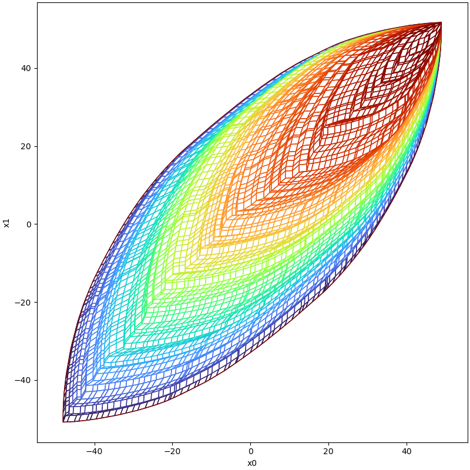

# Zonotope

## Definition

$$
{\cal Z} \coloneqq \{
c+\sum_{i=1}^{p} \beta_{i} g^{i} \ \big| \ \beta_{i} \in [-1,1]
\}
$$

shorthand as ${\cal Z}=\left<c,G \right>$, order defined as $o=\frac{G_{col}}{G_{row}}$

## Example

```python
from pyrat.geometry import Zonotope
from pyrat.geometry.operation import partition
from pyrat.util.visualization import plot

# random zonotope with 100 generators in 2d space
z = Zonotope.rand(2, 100)
# split this zonotope in smaller cells as zonotope
zono_parts = partition(z, 1, Geometry.TYPE.ZONOTOPE)

# visualize the final result
plot([*zono_parts,z], [0, 1])
```



## Operations

### enclose

### reduce

### cartesian product

$$
{\cal Z_0} \times {\cal Z_1} = \left\{ [z_0^T \ z_1^T]^T \ \big| \ z_0 \in {\cal Z_0}, z_1 \in {\cal Z_1} \right\}
$$

### quadratic map

$$
[Z_0] Q [Z_1] = \sum_i^I \sum_j^J [Z_0]_i Q_{ij} [Z_1]_j
$$

${\cal Z_{Q}}=\{\lambda | \lambda_{i}= x^T Q^{i} x, x \in {\cal Z}\}$ can be over approximated by a zonotope
${\cal Z}=(d,h^0, h^1, \cdots , h^{\delta})$ where $$\delta = \begin{pmatrix} p+2 \\ 2 \end{pmatrix} -1$$, the center is
computed as

$$
d_{i} = c^T Q^i c + 0.5 \sum_{s=1}^{p} {g^s}^T Q^i g^s
$$

and the generators are computed as

$$
\begin{cases}
h_i^j = c^T Q^i g^j + {g^j}^T Q^i c, j=1 \cdots p \\
h_i^{p+j} = 0.5 {g^j}^T Q^i g^j, j=1 \cdots p \\
h_i^{2p+l} = {g^j}^T Q^i g^k + {g^k}^T Q^i g^j, l= \sum_{j=1}^{p-1} \sum_{k=j+1}^{p} 1
\end{cases}
$$

check reference [2] for more.

## Arithmetic

### addition or '+'

+ with another zonotope

$$
\left<c_{0},G_{0} \right> + \left<c_{1},G_{1} \right> =
\left<c_{0}+c_{0},\left[G_{0} \ G_{1} \right] \right>
$$

+ with another interval

$$
\left< c,G \right> + [a,b] = \left<c+\frac{a+b}{2},\left[G,\frac{b-a}{2} \right] \right>
$$

+ with another real number

$$
\left<c,G \right> + a = \left< c+a,G \right>
$$

### multiplication or '*'

+ with another real number

$$
\left<c,G \right> \cdot a = \left< a \cdot c , a \cdot G\right>
$$

+ with another interval

$$
\left< c,G \right> \cdot [a,b] =
\left<
\frac{a+b}{2} c,
\left[
\frac{b-a}{2} c,
\frac{a+b}{2} G,
\frac{b-a}{2} G
\right]
\right>
$$

+ with another zonotope

$$
\left<c_{0},G_{0} \right> \cdot \left<c_{1},G_{1} \right> =
\left<
c_0 c_1,
\left[
c_1 G_0, c_0 G_1,
g_0^0 g_1^0, \cdots, g_0^i g_1^j, \cdots, g_0^p g_1^q \right]
\right>
$$

### matrix multiplication or '@'

+ real matrix with zonotope matrix

$$
(X[Z])_{ij} = \sum_{k=1}^{n} X_{ik} [Z]_{kj}
$$

+ zonotope matrix with real matrix

$$
([X]Z)_{ij} = \sum_{k=1}^{n} [X]_{ik} Z_{kj}
$$

+ zonotope matrix with another zonotope matrix

$$
([X][Z])_{ij} = \sum_{k=1}^{n} [X]_{ik} [Z]_{kj}
$$

where $[X] \sube \R^{o \times n}$ and $[Z] \sube \R^{n \times p}$

## References

[1]: Kühn, W. (1998). Rigorously computed orbits of dynamical systems without the wrapping effect. Computing, 61(1),
47-67.

[2]: Althoff, M., & Krogh, B. H. (2012, April). Avoiding geometric intersection operations in reachability analysis of
hybrid systems. In Proceedings of the 15th ACM international conference on Hybrid Systems: Computation and Control (pp.
45-54).

[3]: Althoff, M. (2010). Reachability analysis and its application to the safety assessment of autonomous cars (Doctoral
dissertation, Technische Universität München).

[4]: Althoff, M., Krogh, B. H., & Stursberg, O. (2011). Analyzing reachability of linear dynamic systems with parametric
uncertainties. In Modeling, Design, and Simulation of Systems with Uncertainties (pp. 69-94). Springer, Berlin,
Heidelberg.

[5]: Yang, X., & Scott, J. K. (2018). A comparison of zonotope order reduction techniques. Automatica, 95, 378-384.

[6]: Althoff, M. (2015). On computing the minkowski difference of zonotopes. arXiv preprint arXiv:1512.02794.
